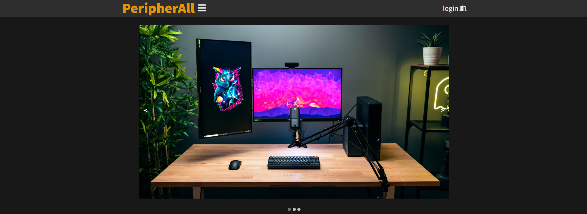
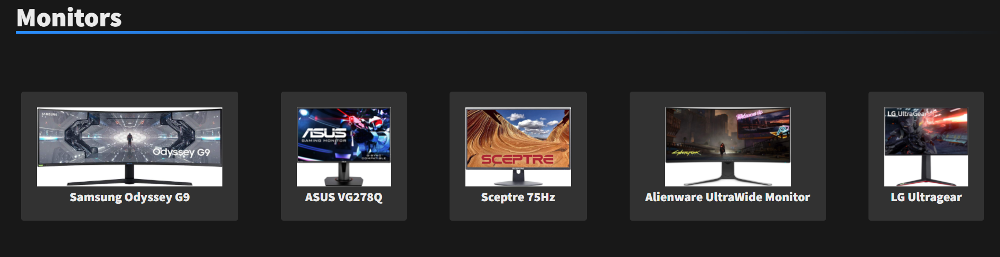
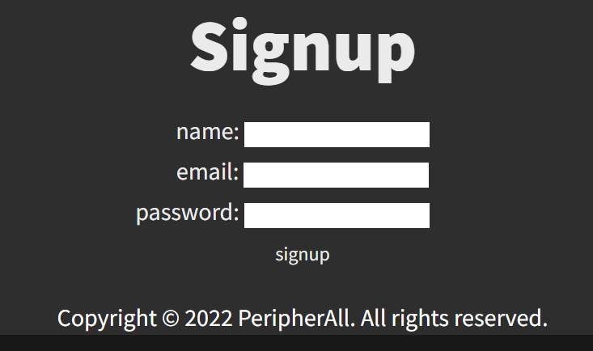

<h1><a href="https://peripherall.herokuapp.com/">PeripherAll</a></h1>

## Description

A user can search computer peripherals accross different categpries and recieve information about the products. There is also a link to amazon where the user can purchase the product. They can then log in and leave a review for it on the product page.

## How to use
1. Once on the homepage you can make an account by clicking the login dropdown menu in the upper right corner. After that you can select create an account. That brings you to a new page where you can put in your information.
2. You can then navigate back to home to view all the products either by using the hamburger menu or by scrolling down the different product categories.
3. If you click on a particular product a new page with a description, price and buy link will appear.
4. Below all of that information you can leave a review for the product using the account you made from the login page.

## Homepage display of website

## Category on Homepage

## Individual product page

## Review

## Signup page

<a href="https://opensource.org/licenses/MIT">MIT License</a>

# Contributors

